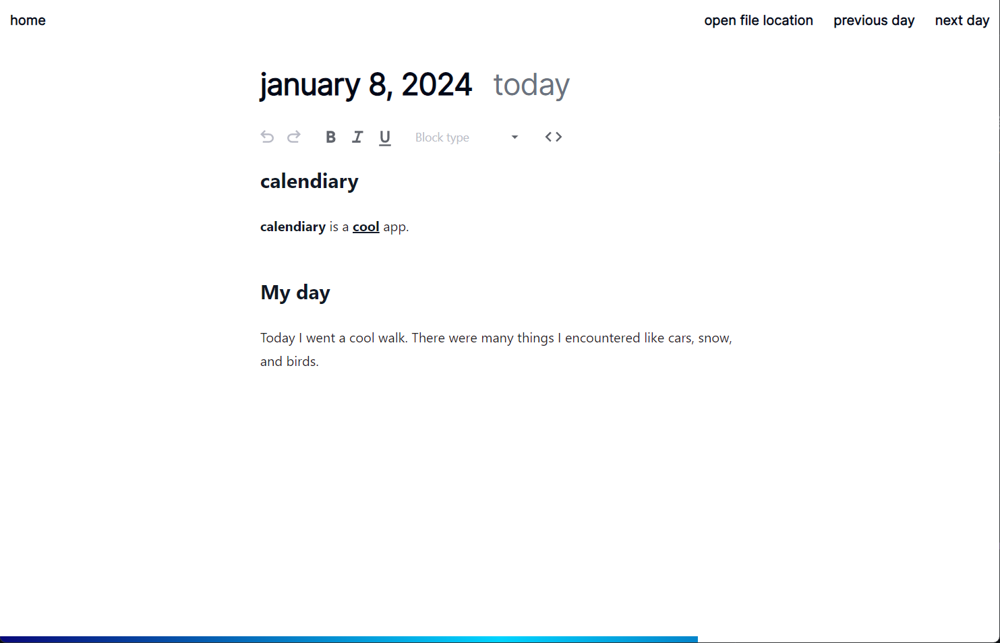

calendiary is desktop application that lets you have an integrated digital calendar and diary together. You can create a new daily entry where you can write and reflect about your day. You can also look back at previous entries you made through the calendar.

The diary is stored in markdown files through the following folder structure: `{year}/{month}/{day}/{month}-{day}-{year}.md`. calendiary allows you to create a new diary by selecting a new folder or load up and existing one to view or create new entries.

## Photos

### Home Page


This is the home page of calendiary. You can scroll down and see the different months of the year and also look at available diary entries (days represented in green). The blue day represents the current day. The gray day represents days that have passed and also days that don't have a diary entry. Clicking on any of the days will lead you to the diary page.

### Diary Page


This is the diary page for a diary entry. You can make changes to the diary entry with the Markdown editor, and go through the next and previous days. A progress bar is at the bottom of the page which represents how much percentage of the day has passed.

## Downloads

Head to the [releases](https://github.com/ma-ray/calendiary/releases) page.

## Development Instructions

Install dependencies:

```
yarn
```

Start development:

```
yarn dev
```

Build:

```
yarn build
```
